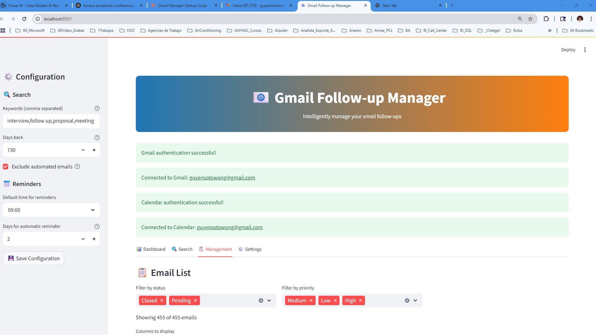

# Gmail Follow-up Manager

A powerful Streamlit application for intelligently managing email follow-ups using Gmail API and Google Calendar integration.

## 🚀 Features

- **Email Analysis**: Automatically analyze sent emails to identify follow-up opportunities
- **Smart Filtering**: Filter emails by keywords, date ranges, and automated email detection
- **Priority Management**: Assign and track email priorities (High, Medium, Low)
- **Status Tracking**: Track email status (Pending, Following Up, Contacted Again, Closed, No Response Needed)
- **Calendar Integration**: Create automatic follow-up reminders in Google Calendar
- **Analytics Dashboard**: Visual analytics with charts and metrics
- **Data Export**: Export email data to Excel format
- **Backup Management**: Automatic backup and restore functionality
- **Responsive UI**: Clean, modern interface with real-time updates

## 📸 Screenshots

### Dashboard Overview
Get a comprehensive view of your email follow-up metrics and analytics.


### Analytics Dashboard
Monitor your email response rates and follow-up performance with detailed charts.


### Email Search Interface
Search and filter emails with advanced criteria to identify follow-up opportunities.


### Management Interface - Email List
View and manage your tracked emails with status updates and priority assignments.



### Management Interface - Email Details
Edit email details, add notes, and update follow-up status.


### Management Interface - Calendar Integration
Create calendar reminders and manage follow-up schedules directly from the interface.


### Settings Panel
Configure application settings, authentication, and system preferences.


### Backup Management
Manage data backups and restore previous versions of your email tracking data.


## 📋 Prerequisites

- Python 3.12 or higher
- Google Cloud Project with Gmail API and Calendar API enabled
- Gmail account with API access
- `uv` package manager (recommended) or `pip`

## 🛠️ Installation

### Step 1: Clone the Repository

```bash
git clone <repository-url>
cd gmail-followup-manager
```

### Step 2: Install Dependencies

Using `uv` (recommended):
```bash
uv sync
```

Or using pip:
```bash
pip install -r requirements.txt
```

### Step 3: Google API Setup

1. **Create a Google Cloud Project**:
   - Go to [Google Cloud Console](https://console.cloud.google.com/)
   - Create a new project or select an existing one

2. **Enable APIs**:
   - Enable Gmail API
   - Enable Google Calendar API

3. **Create Credentials**:
   - Go to "Credentials" in the Google Cloud Console
   - Click "Create Credentials" → "OAuth 2.0 Client IDs"
   - Choose "Desktop application"
   - Download the JSON file and rename it to `credentials.json`
   - Place it in the project root directory

### Step 4: Environment Configuration

Create a `.env` file in the project root:

```env
# Data directories
DATA_DIR=data
EXPORTS_DIR=data/exports

# Google API
GOOGLE_CREDENTIALS_FILE=credentials.json

# Application settings
APP_NAME=Gmail Follow-up Manager
DEFAULT_LOOKBACK_DAYS=30
MAX_RESULTS=200

# UI Configuration
PAGE_TITLE=Gmail Follow-up Manager
PAGE_ICON=📧
LAYOUT=wide

# Backup settings
MAX_BACKUPS=10
AUTO_BACKUP=true

# OAuth ports (change if needed)
OAUTH_PORT_GMAIL=8080
OAUTH_PORT_CALENDAR=8081
```

### Step 5: Run the Application

Using `uv`:
```bash
uv run streamlit run app.py
```

Or using standard Python:
```bash
streamlit run app.py
```

The application will open in your default browser at `http://localhost:8501`.

## 🔧 Configuration

### First Run Setup

1. **Authentication**: On first run, you'll be prompted to authenticate with Google
2. **Gmail Access**: Grant permission to read your Gmail
3. **Calendar Access**: Grant permission to create calendar events
4. **Data Directory**: The app will automatically create necessary directories

### Settings Configuration

Use the sidebar to configure:
- **Keywords**: Comma-separated keywords for email filtering
- **Lookback Days**: How many days back to search for emails
- **Automated Email Filtering**: Exclude no-reply and automated emails
- **Reminder Settings**: Default time and frequency for calendar reminders

## 📖 Usage Guide

### 1. Dashboard Tab
- View analytics and metrics
- See upcoming follow-ups
- Monitor email response rates

### 2. Search Tab
- Search for emails using Gmail labels
- Apply keyword and date filters
- Analyze sent emails for follow-up opportunities

### 3. Management Tab
- View and edit existing email data
- Update email status and priorities
- Add notes and manage follow-ups
- Create calendar reminders

### 4. Settings Tab
- Manage authentication credentials
- Configure backup settings
- View system information

## 🔍 Key Functionalities

### Email Search and Analysis
```python
# The app automatically:
# 1. Searches Gmail using specified criteria
# 2. Analyzes email content and recipients
# 3. Detects replies and response times
# 4. Assigns priority based on content
# 5. Merges with existing tracking data
```

### Calendar Integration
- Automatically creates follow-up events
- Includes email context and recipient information
- Sets appropriate reminders
- Provides direct links to calendar events

### Data Management
- Automatic backup before data changes
- Excel export functionality
- Data persistence across sessions
- Merge capabilities for new and existing data

## 🗂️ Project Structure

```
gmail-followup-manager/
├── app.py                 # Main Streamlit application
├── pyproject.toml         # Project dependencies and metadata
├── .env                   # Environment variables
├── credentials.json       # Google API credentials (you provide)
├── Images/                # Screenshots and documentation images
│   ├── 001_Dashboard.jpg
│   ├── 011_Dashboard.jpg
│   ├── 015_Search.jpg
│   ├── 020_Managment_Menu1.jpg
│   ├── 030_Managment_Menu2.jpg
│   ├── 040_Managment_Menu3.jpg
│   ├── 050_Settings.jpg
│   └── 060_Settings_Backup.jpg
├── src/
│   ├── __init__.py
│   ├── config.py          # Application configuration
│   ├── auth/
│   │   ├── __init__.py
│   │   └── gmail_auth.py  # Gmail authentication
│   ├── services/
│   │   ├── __init__.py
│   │   ├── gmail_service.py    # Gmail API operations
│   │   ├── calendar_service.py # Calendar API operations
│   │   └── data_service.py     # Data management
│   ├── ui/
│   │   └── __init__.py
│   └── utils/
│       └── __init__.py
├── data/                  # Application data (auto-created)
│   ├── email_tracking.xlsx
│   ├── email_tracking.csv
│   ├── app_settings.json
│   ├── exports/
│   └── backups/
└── README.md
```

## 🔒 Security and Privacy

- **Local Data Storage**: All email data is stored locally on your machine
- **OAuth 2.0**: Secure authentication using Google's OAuth 2.0
- **Read-Only Gmail Access**: The app only reads your Gmail (no modifications)
- **Calendar Write Access**: Limited to creating follow-up events
- **No External Servers**: No data is sent to external servers

## 🐛 Troubleshooting

### Common Issues

1. **Authentication Errors**:
   - Ensure `credentials.json` is in the project root
   - Check that Gmail and Calendar APIs are enabled
   - Try revoking and re-authenticating

2. **Import Errors**:
   - Verify all dependencies are installed: `uv sync`
   - Check Python version (3.12+ required)

3. **Permission Errors**:
   - Ensure the app has write permissions in the project directory
   - Check that data directories can be created

4. **API Quota Exceeded**:
   - Gmail API has daily quotas
   - Reduce the number of emails searched
   - Wait for quota reset (usually 24 hours)

### Debug Mode

Run with debug information:
```bash
uv run streamlit run app.py --logger.level=debug
```

## 🤝 Contributing

1. Fork the repository
2. Create a feature branch: `git checkout -b feature-name`
3. Make your changes
4. Add tests if applicable
5. Commit your changes: `git commit -am 'Add feature'`
6. Push to the branch: `git push origin feature-name`
7. Submit a pull request

## 📄 License

This project is licensed under the MIT License - see the LICENSE file for details.

## 🆘 Support

If you encounter any issues or have questions:

1. Check the troubleshooting section above
2. Review the [Google API documentation](https://developers.google.com/gmail/api)
3. Open an issue on GitHub with:
   - Error messages
   - Steps to reproduce
   - Your environment details

## 🔄 Updates and Maintenance

- **Backup your data** before updating
- Check for API changes in Google's documentation
- Update dependencies regularly: `uv sync --upgrade`
- Monitor the application logs for any issues

## 📊 Performance Tips

- **Limit search scope**: Use specific date ranges and keywords
- **Regular cleanup**: Archive old email data periodically
- **Backup management**: Keep only necessary backups
- **API efficiency**: Avoid frequent re-authentication

---

**Version**: 1.0.0  
**Last Updated**: 2025-06-03  
**Compatibility**: Python 3.12+, Streamlit 1.45+